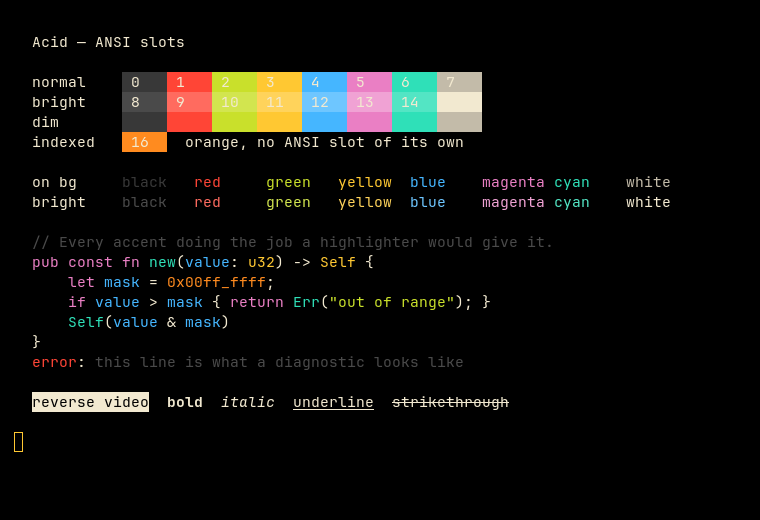
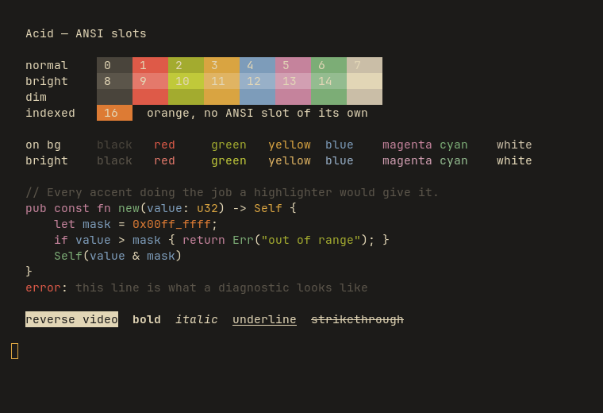

# Acid for Alacritty

Two flavours: **Acetic** (`#000000`), vibrant, and **Citric** (`#1c1b19`), muted.

Part of [Acid](https://github.com/acid-theme/acid), a very dark colourscheme in two
flavours. The main README lists the other ports.

## Preview

| Acetic | Citric |
| --- | --- |
|  |  |

## Install

```sh
curl -fsSLo ~/.config/alacritty/acid-acetic.toml \
  https://raw.githubusercontent.com/acid-theme/alacritty/main/acid-acetic.toml
```

Then import it from `alacritty.toml`:

```toml
[general]
import = ["~/.config/alacritty/acid-acetic.toml"]
```

Anything under `[colors]` in the main config overrides the import. A leftover
`[colors.primary] background` line pins citric to acetic's black.

## Files

- `acid-acetic.toml`
- `acid-citric.toml`

## Generated

Acid 0.1.0, rendered by acidify from
[`ports/alacritty/acid.toml.tera`](https://github.com/acid-theme/acid/blob/main/ports/alacritty/acid.toml.tera).
Edits to these files are overwritten on the next release. Report issues on
[acid-theme/acid](https://github.com/acid-theme/acid/issues).

## Licence

MIT.
