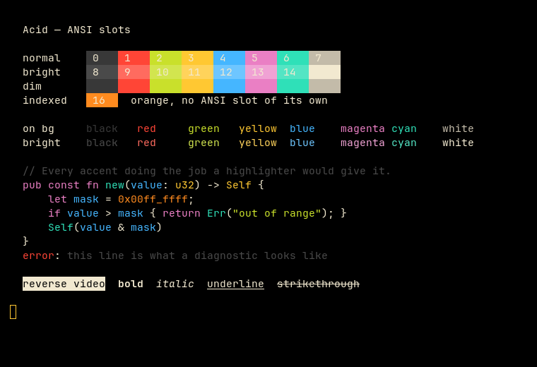
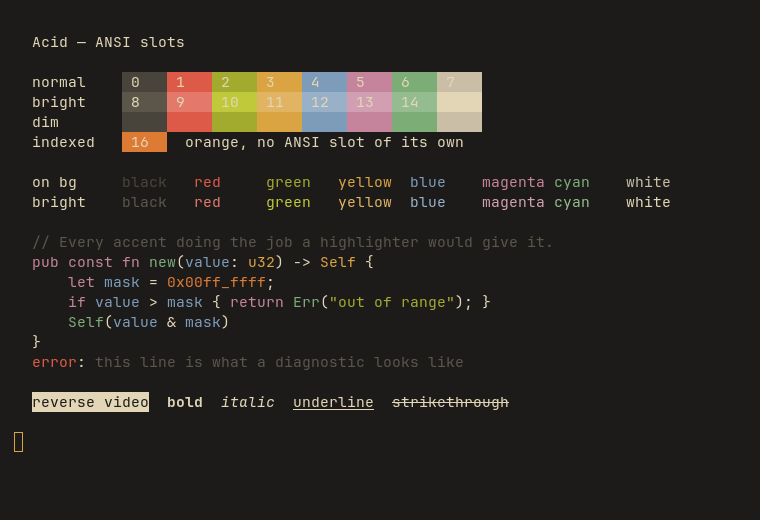
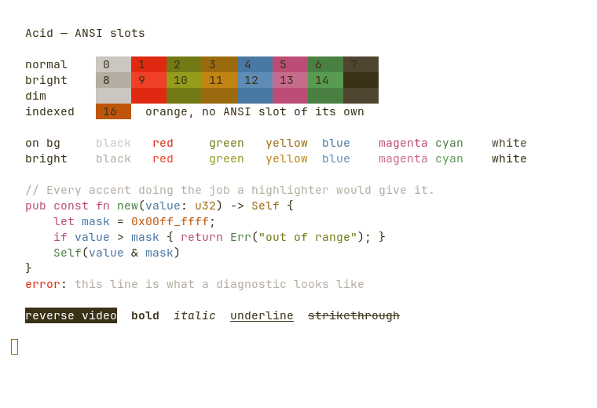

# Acid for Alacritty

Generated from [acid-theme/acid](https://github.com/acid-theme/acid) — open issues
and pull requests there.

<details>
<summary>Screenshots</summary>

| Acetic | Citric | Lactic |
| --- | --- | --- |
|  |  |  |

</details>

## Install

```sh
curl -fsSLo ~/.config/alacritty/acid-acetic.toml \
  https://raw.githubusercontent.com/acid-theme/alacritty/main/acid-acetic.toml
```

Then import it from `alacritty.toml`:

```toml
[general]
import = ["~/.config/alacritty/acid-acetic.toml"]
```

Anything under `[colors]` in the main config overrides the import, so remove
leftover colour lines.

## Credits

[@ssiyad](https://github.com/ssiyad)
